# Austin FloodOps: Architecture Explained

This document describes the code as it exists now. Austin FloodOps is a hackathon decision-support prototype. It does not predict a flood with a hydraulic model, dispatch responders, control road gates, or claim an authorized connection to a government system.

## 1. The problem

Flood evidence arrives from different systems and at different speeds. A weather warning may be issued while a river gage rises and a low-water crossing becomes unsafe. An operator must correlate the evidence, decide what to review, and preserve a defensible record. Austin FloodOps reduces that coordination delay while keeping the human in control.

The primary hackathon fit is the Red Hat Live Data track. The track requires real updating data to do meaningful work; it does not require Red Hat Streams for Apache Kafka. This project polls real public feeds on a thirty-second heartbeat. When a Kafka-compatible broker is configured, each new event is also published, consumed, validated, and then assessed.

## 2. End-to-end flow

```mermaid
flowchart LR
    A["Live public feeds\nNWS + USGS + Austin"] --> B["Normalize to FloodEvent"]
    B --> C["Deduplicate by stable event_id"]
    C --> D{"Kafka configured?"}
    D -->|yes| E["Publish → consume → validate"]
    D -->|no| F["Explicit direct path"]
    E --> G["HiddenLayer input scan"]
    F --> G
    G --> H["Nemotron structured decision"]
    H --> I["Citation grounding"]
    I --> J["Deterministic policy gate"]
    J --> K["SQLite ledger + optional Supabase mirror"]
    K --> L["Human reviews, approves, rejects, or corrects"]
    L --> M["Versioned playbook memory"]
```



The stream status records whether Kafka was verified, degraded, skipped, or not configured. A broker failure never masquerades as success. The direct safety fallback is counted and shown.

## 3. Evidence sources

- National Weather Service, abbreviated NWS: active Texas alerts from `api.weather.gov`.
- United States Geological Survey, abbreviated USGS: instantaneous gage height and streamflow observations from `waterservices.usgs.gov`.
- City of Austin Open Data: low-water-crossing records and attempted road-closure records.
- Lower Colorado River Authority, abbreviated LCRA: an attempted river-stage adapter. It is marked degraded if the endpoint is unavailable or unsupported.
- Texas Department of Transportation, abbreviated TxDOT: an attempted DriveTexas closure adapter. It is marked degraded if it cannot parse observed public records.
- Austin 311: an attempted public-service-report adapter. It is marked degraded when unavailable.

Live adapters never fabricate replacement records. Deterministic replay fixtures are separate and carry `mode: replay`.

Every source record is converted to a `FloodEvent` with a stable identifier, source, observation time, event kind, title, severity, location, optional value and unit, freshness, provenance address, and mode. Stable identifiers make polling idempotent: an unchanged record is stored once, while a changed record can produce a new fingerprint.

Example normalized event:

```json
{
  "event_id": "usgs-08158000-00065-2026-07-18T21:30:00Z",
  "source": "usgs",
  "observed_at": "2026-07-18T21:30:00Z",
  "kind": "water_observation",
  "title": "Gage height at Colorado River at Austin",
  "severity": "unknown",
  "location": "Colorado River at Austin",
  "value": 12.4,
  "unit": "ft",
  "freshness_seconds": 94.0,
  "provenance_url": "https://waterservices.usgs.gov/...",
  "mode": "live"
}
```

## 4. Streaming

Apache Kafka is an event-streaming protocol and log. A producer writes records to a topic; a consumer group reads them in order within each partition and tracks its position. The local Docker Compose stack uses Redpanda, which implements the Kafka protocol. This is useful for demonstrating the stream without depending on a retired hosted Red Hat service.

For configured streaming, Austin FloodOps:

1. Publishes every new `FloodEvent` to `floodops.events`, keyed by `event_id`.
2. Reads records with the normalizer consumer group.
3. Validates each record again as a `FloodEvent`.
4. Matches consumed identifiers against the identifiers just published.
5. Sends the consumed objects into security and assessment.

`make stream-smoke` fails unless the probe publishes and consumes the same identifier. The probe uses an isolated consumer group so it cannot race with the heartbeat worker.

## 5. Security and model decision

When HiddenLayer credentials are configured, the service scans six boundaries: ingested content, prompt and memory, model request, proposed tool call, tool result, and final answer. Suspicious ingested text is quarantined before it reaches the model. If a required security scan fails, the assessment fails closed.

NVIDIA Nemotron receives at most the eight newest evidence items plus relevant operator-validated playbook rules. The prompt treats source text as untrusted and requests exactly one reversible, approval-gated action. The adapter validates the returned object, retries one malformed or transient response, clamps confidence to zero through one, and restricts action and risk values to enumerated choices.

Model citations are not trusted. Every normalized citation must exactly equal an input `event_id` or provenance address that the model actually wrote. Some Nemotron deployments write exact evidence identifiers in the rationale while serializing an empty citations array, so the adapter can normalize those exact model-written references into the typed citations field. It never invents or silently fills a missing reference. If fewer than the required number of grounded model references exist, the assessment fails closed.

Example decision:

```json
{
  "risk_level": "high",
  "confidence": 0.93,
  "proposed_action": {
    "action_type": "request_approval",
    "target": "Colorado River at Austin",
    "approval_required": true,
    "reversible": true
  },
  "citations": ["nws-alert-id", "usgs-gage-id", "austin-crossing-id"],
  "policy_status": "approval_required"
}
```

The model recommends; it never grants itself permission. The deterministic policy blocks irreversible actions and requires a human approval for allowed actions. Delivery to a responder adapter is a separate explicit confirmation.

## 6. Storage and learning

SQLite is the authoritative local ledger. Supabase is an optional best-effort mirror. The ledger stores evidence, decisions, feedback, playbook memories, resource-demo state, and a chained application audit log.

Operator feedback is reflected into a typed playbook rule containing a trigger, action, rationale, confidence, and tags. Relevant active rules are retrieved for later incidents. Rules are versioned and can be retired. The evaluation harness runs three replay scenarios before and after known corrections to measure accuracy, latency, and required interventions. It is a deterministic product demonstration, not proof of field effectiveness.

## 7. Simulation and prediction

The impact simulation is a transparent threshold heuristic. It combines alert severity and gage values into a score, then maps that score to illustrative depth, exposure, and route delay. These outputs are useful for interface rehearsal and comparing scenarios. They are not a hydraulic calculation and must not be used as official inundation estimates.

The prediction feature fits a simple linear trend to recent gage observations, projects that trend to configured time horizons, and applies the same risk heuristic. It reports its method, assumptions, confidence, and cited inputs. Reliable operational forecasting would require station-specific rating curves, rainfall-runoff models, terrain, drainage, forecast uncertainty, and agency calibration.

## 8. Responder interoperability

Common Alerting Protocol version 1.2, abbreviated CAP, is an XML format for exchanging public warnings. Emergency Data Exchange Language Distribution Element, abbreviated EDXL-DE, is an envelope format for routing emergency messages. WebEOC is a commercial emergency-operations information-management product.

The project can generate CAP and EDXL-DE-shaped exports and contains a WebEOC SOAP adapter. SOAP means Simple Object Access Protocol, an XML web-service protocol. These exports are prototypes and have not been certified by an agency or vendor. WebEOC delivery remains blocked unless complete organization-issued settings, prior policy approval, explicit confirmation, and idempotency checks all pass.

## 9. What is real and what is demonstrated

Real and testable: public live feeds, heartbeat updates, Kafka-compatible round trip, hosted Nemotron call, citation grounding, approval gate, SQLite ledger, feedback memory, replay evaluation, and runtime integration states.

Optional and verifiable only when configured: HiddenLayer, Supabase, vLLM, WebEOC, generic responder webhook, and OpenShell gateway.

Demonstration-only: seeded resource inventory, replay incidents, threshold impact numbers, linear gage forecast, and standards exports pending validation.

## 10. Safety boundary

Austin FloodOps is not an emergency warning source. During an actual emergency, follow local authorities and official National Weather Service alerts. Before any operational pilot, the system needs agency authorization, source contracts, station calibration, reliability engineering, accessibility review, incident exercises, and an independent security and safety assessment.
