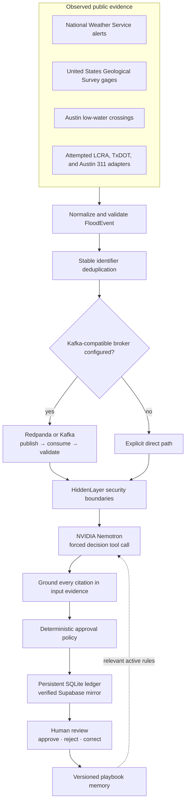
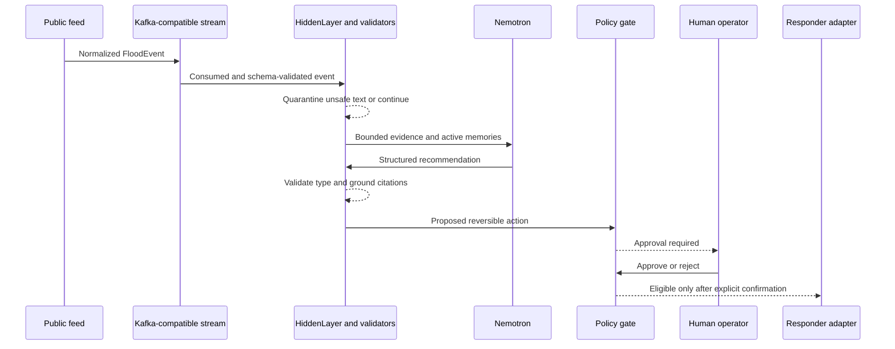
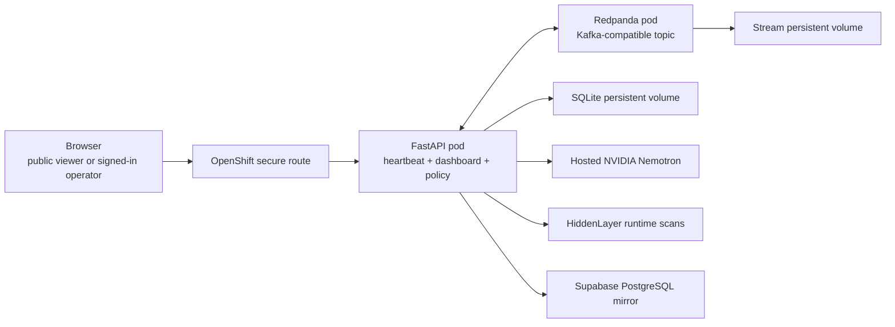
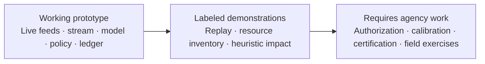

# Austin FloodOps: Visual Architecture

## Live decision loop

## Trust boundaries

## Sponsor-tool contribution

| Tool | Work it performs | Proof in the product |
|---|---|---|
| NVIDIA Nemotron | Correlates live evidence by calling a constrained decision function | Decision contains model name, tool arguments, rationale, and exact grounded citations |
| HiddenLayer Runtime Security | Scans untrusted evidence and model boundaries | Security panel shows each real boundary outcome; suspicious content is quarantined |
| NemoClaw and OpenShell | Restricts filesystem, process, and network access when launched in that sandbox | Checked-in policy and deny evidence; not claimed when running plain Docker Compose |
| Redpanda using the Kafka protocol | Provides the live event backbone locally and on OpenShift | Runtime state and `make stream-smoke` prove publication and consumption of the same event identifier |
| Supabase | Mirrors the local ledger into hosted PostgreSQL | Production runtime probe and best-effort writes; SQLite remains authoritative |

## Deployed topology

OpenShift Secrets provide server credentials. Anonymous users are read-only;
the demo login issues a supervisor token held only in browser memory.

## Demo versus operational status

The Red Hat Live Data track does not require a Red Hat-hosted Kafka service. The qualifying heartbeat is the updating public data itself. Kafka-compatible streaming strengthens the architecture by making freshness, replay, back pressure, and consumer independence explicit.
