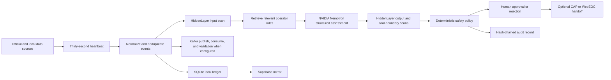

# Austin FloodOps: spoken system guide

This guide is written as a narration that can be read aloud directly or pasted into a voice conversation. Use the displayed text when you want to inspect an exact payload, formula, command, or source link.

## Chapter 1 — The one-minute explanation

Austin FloodOps is a human-supervised flood decision-support system. It does not stop rain, build levees, control dams, or physically prevent a flood. It tries to prevent avoidable harm during a flood by shortening the time between four things: an official warning, a rising river observation, an understandable recommendation, and a human-approved response.

Imagine that a National Weather Service warning appears at the same time that a United States Geological Survey stream gage reports rapidly rising water. Today, those facts may live in different websites and may require a busy emergency operator to assemble them mentally. Austin FloodOps collects the facts, normalizes them into one event format, preserves links back to the original sources, runs security checks, calculates a transparent screening estimate, asks an NVIDIA Nemotron language model for a structured recommendation, and stops at a human approval gate. Only after a qualified operator approves can a separate adapter prepare or transmit a responder message.

The system is therefore an evidence-and-decision layer, not an autonomous emergency commander. Its central promise is: get the right evidence into one place, explain why a response is being proposed, keep a human in control, and preserve an audit trail.

## Chapter 2 — The problem it solves

Flood response has a coordination problem as well as a water problem. Weather alerts describe a hazard over an area. Stream gages describe conditions at particular instruments. Road-closure systems describe transportation effects. Local reports describe what people are seeing. Resource systems describe where barricades and crews are. These sources do not automatically form one coherent incident picture.

Austin FloodOps is designed to answer five operational questions:

1. What is happening now, and where did each fact come from?
2. How serious might it be if the observed signals continue?
3. What reversible action should an operator consider first?
4. Has a human approved that action?
5. Can we later reconstruct what the system knew, recommended, and did?

The project could eventually support other hazards because its core pattern is general: ingest authoritative evidence, normalize it, assess it, gate action, and audit the result. A wildfire version would use fire detections, wind, and evacuation zones. A tornado version would use warnings, radar-derived products, and shelter status. A heat version would use temperature, humidity, power outages, and cooling centers. The present code, however, is specifically shaped around flooding.

## Chapter 3 — Flooding and water measurements from first principles

A flood occurs when water covers land that is normally dry. The water may come from a river leaving its channel, intense rainfall overwhelming drainage, water moving rapidly through a small watershed, coastal storm surge, or a failed water-control structure.

A flash flood is especially dangerous because it develops quickly, often within minutes or a few hours. Central Texas is vulnerable because intense rainfall can run rapidly off steep or rocky ground into creeks, roads, and low-water crossings. A low-water crossing is a road segment built at or near the normal level of a creek. It may be usable when the creek is low and deadly when fast water crosses it.

The National Weather Service uses different alert terms. A flood watch means conditions are favorable and people should be prepared. A flood warning means flooding is imminent or occurring and people should take action. A flash flood warning means sudden flooding is imminent or occurring and people in danger should move to higher ground. The official distinctions are described by the [National Weather Service](https://www.weather.gov/safety/flood-watch-warning).

A stream gage is an instrument station that repeatedly measures a river or creek. Two common measurements are gage height and discharge.

Gage height, also called stage, is the height of the water surface above a reference elevation chosen for that station. It is not automatically the depth of water on a nearby road, and it is not automatically elevation above sea level. A reading of thirteen feet means the water surface is thirteen feet above that instrument's local reference point. The meaning is station-specific. The [United States Geological Survey gage-height explanation](https://waterdata.usgs.gov/blog/gage_height/) is the authoritative reference.

Discharge, also called streamflow, is the volume of water moving past a cross-section per unit time. In the United States it is often expressed as cubic feet per second. One cubic foot per second means one cubic foot of water passes the measurement cross-section every second. A rating curve is a station-specific relationship used to estimate discharge from gage height. It is not universal, and it can change when the river channel changes. The [United States Geological Survey streamgaging guide](https://www.usgs.gov/mission-areas/water-resources/science/streamgaging-basics) explains this process.

A floodplain is land that has some probability of being flooded. The phrase one-hundred-year floodplain does not mean it floods only once every one hundred years. It means a one-percent chance of that level of flooding in any given year. Several such floods can happen close together. The [Federal Emergency Management Agency glossary](https://training.fema.gov/is/course/glossary.aspx) explains the annual-chance terminology.

This distinction is crucial when presenting Austin FloodOps. A gage value is evidence, not a complete inundation map. To predict actual water depth on every road, a production system needs locally calibrated flood thresholds or a hydraulic model. A hydraulic model represents how water moves through channels and across terrain. The current project does not contain a calibrated hydraulic model.

## Chapter 4 — Vocabulary and every abbreviation

The National Weather Service, abbreviated N W S, is the United States weather agency that issues watches, warnings, and forecasts.

The United States Geological Survey, abbreviated U S G S, operates many stream gages and publishes water observations.

The Lower Colorado River Authority, abbreviated L C R A, manages water and energy infrastructure in the lower Colorado River basin of Texas and publishes river information.

The Texas Department of Transportation, abbreviated TxDOT, manages the state transportation system and road information.

The Texas Division of Emergency Management, abbreviated T D E M, coordinates state emergency management.

Web Emergency Operations Center, commonly branded WebEOC, is a web-based incident-management platform used by emergency organizations. Austin FloodOps contains an adapter for its web-service interface, but it requires authorized credentials and board configuration.

Common Alerting Protocol, abbreviated C A P, is a standard Extensible Markup Language message format for emergency alerts. Extensible Markup Language, abbreviated X M L, is a structured text format using named tags.

Emergency Data Exchange Language Distribution Element, abbreviated E D X L D E, is a standard envelope intended to route emergency information packages to recipients.

JavaScript Object Notation, abbreviated J S O N, is the key-and-value text format used by most Austin FloodOps application programming interfaces. An application programming interface, abbreviated A P I, is a defined way for software components to request data or actions from one another.

Comma-Separated Values, abbreviated C S V, is a simple table format suitable for spreadsheets and records exports.

Freedom of Information Act, abbreviated F O I A, is a United States federal public-records law. Texas state records are more precisely governed by the Texas Public Information Act. The dashboard calls this output a records-review bundle. Its legacy application route still ends in slash F O I A for backward compatibility, but the bundle is not a release decision, legal certification, or retention guarantee.

Open Source Routing Machine, abbreviated O S R M, is a routing engine used to calculate road routes.

Progressive Web Application, abbreviated P W A, means a web application that can install a service worker and cache content for degraded or offline use. A service worker is browser code that sits between the page and the network.

Indexed Database, normally written IndexedDB, is a browser-local database. Austin FloodOps uses it to preserve offline action drafts that always require reconfirmation.

FirstNet is the First Responder Network Authority and the nationwide public-safety broadband network. The project is designed with degraded connectivity in mind, but it is not currently certified by or directly integrated with FirstNet.

Role-Based Access Control, abbreviated R B A C, means permissions are assigned according to a user's role. JavaScript Web Token, more commonly called JSON Web Token and abbreviated J W T, is the signed token format used by this project to carry user identity and role information.

Open Authorization version two, abbreviated OAuth 2, is a standard authorization framework. It appears in some platform documentation, though it is not the primary login mechanism in the current dashboard.

Transport Layer Security, abbreviated T L S, encrypts network connections. Simple Authentication and Security Layer, abbreviated S A S L, is a framework for authenticating network clients. Salted Challenge Response Authentication Mechanism, abbreviated S C R A M, is a password-based authentication method. These terms matter when connecting the Kafka client to a secured Red Hat broker.

Apache Kafka is an event-streaming system. A producer writes ordered event records to a topic. A consumer reads them. Red Hat Streams for Apache Kafka is Red Hat's supported Kafka distribution.

NVIDIA Inference Microservices, abbreviated N I M, are packaged model-serving runtimes and hosted interfaces. Nemotron is an NVIDIA family of language models. Austin FloodOps calls a configurable Nemotron model through an OpenAI-compatible chat-completions interface. OpenAI-compatible describes the request shape; it does not mean the model is an OpenAI model.

Very Large Language Model, abbreviated v L L M, is an open-source model-serving engine. The project can use a v L L M server as a separately configured fallback.

NemoClaw is NVIDIA's reference stack for running persistent artificial-intelligence agents inside OpenShell sandboxes. OpenShell provides operating-system, file, process, inference, and outbound-network policy boundaries. NVIDIA's [NemoClaw overview](https://docs.nvidia.com/nemoclaw/latest/about/overview.html) explains that relationship.

HiddenLayer is the runtime artificial-intelligence security service used to inspect untrusted content and model interactions for signals such as prompt injection or sensitive-data leakage. Prompt injection is malicious or accidental text that tries to make a model ignore its governing instructions.

Supabase is a hosted platform built around a real PostgreSQL database. PostgreSQL is a relational database system. Supabase automatically exposes database operations through a Representational State Transfer interface, commonly called a REST interface. The project uses that server-side interface as an optional remote mirror. Supabase's [database overview](https://supabase.com/docs/guides/database/overview) and [Data REST API guide](https://supabase.com/docs/guides/api) explain those components.

SQLite is an embedded relational database stored in a local file. In the present architecture, SQLite is authoritative for local operation and Supabase is a best-effort remote mirror.

## Chapter 5 — End-to-end architecture

Here is the full path in plain language:



When the FastAPI web server starts, it creates a heartbeat engine. FastAPI is the Python web framework exposing the page and endpoints. The heartbeat wakes every thirty seconds by default. It requests each configured source concurrently, meaning one slow source does not have to delay all others. Each source returns normalized FloodEvent objects. Stable event identifiers are used to remove duplicates. Only new events are sent through a new assessment, while all received events can be stored for the timeline.

When a broker is configured, the application publishes new events to Kafka, consumes them through an isolated consumer group, validates each record again, and matches the consumed event identifiers against the published identifiers. Those consumed objects become the assessment evidence. If the broker fails, the service records a degraded stream state and uses a counted direct safety path so live evidence is not lost. The OpenShift deployment and the strict local probe both verify publication and consumption of the same event identifier.

Before model reasoning, the project sends ingested evidence, retrieved memory, and the exact model request to HiddenLayer. If a prompt-injection signal fires or a configured scan cannot complete, inference does not start. After inference, it scans the proposed tool call, deterministic simulation result, and final answer. The decision is verified only when all six boundaries completed. Any missing configured output scan blocks the action, and a prompt-injection signal in model output quarantines that output after inference.

The learning retriever then selects up to three active playbook rules whose words and tags overlap the current evidence. These rules are context, not executable code. The model receives a prompt containing at most the newest eight evidence items and the retrieved rules. NVIDIA Nemotron is forced to call a function named record incident decision. Its schema contains summary, risk, confidence, action, target, rationale, and citations. The parser rejects free-form output, unrelated function calls, unknown risk levels, unknown action types, and citations that are not exact input evidence identifiers.

The deterministic policy evaluates the proposed action. Non-reversible actions are blocked. Quarantine is blocked from dispatch. High and catastrophic recommendations require approval. All other supported actions also remain approval-gated. Approval changes the decision's policy status to allowed, but approval does not itself send a responder message. Message delivery is a distinct, explicit call with confirmation.

Each important transition is appended to a SHA-256 hash chain. SHA-256 means Secure Hash Algorithm with a two-hundred-fifty-six-bit output. Each new record includes the previous record's hash, so editing an earlier payload breaks later links. This is tamper-evident, not tamper-proof. Someone with full database access could rewrite all records and recompute the chain unless the hashes are also anchored in an external signed system.

## Chapter 6 — Raw input and normalization example

The National Weather Service sends a large GeoJSON feature. GeoJSON means JavaScript Object Notation for geographic features. A simplified incoming warning can look like this:

```json
{
  "id": "https://api.weather.gov/alerts/abc123",
  "type": "Feature",
  "geometry": {
    "type": "Polygon",
    "coordinates": [[[-97.80, 30.20], [-97.60, 30.20], [-97.60, 30.40]]]
  },
  "properties": {
    "event": "Flash Flood Warning",
    "severity": "Severe",
    "areaDesc": "Travis County",
    "sent": "2026-07-18T01:00:00-05:00"
  }
}
```

The adapter keeps flood-related alerts, extracts the fields the system needs, preserves the original payload under `raw`, and adds receipt and provenance information. The normalized object looks like this:

```json
{
  "event_id": "nws-abc123",
  "source": "nws",
  "observed_at": "2026-07-18T06:00:00Z",
  "received_at": "2026-07-18T06:00:02Z",
  "kind": "weather_alert",
  "title": "Flash Flood Warning",
  "severity": "severe",
  "location": "Travis County",
  "latitude": 30.30,
  "longitude": -97.70,
  "value": null,
  "unit": null,
  "provenance_url": "https://api.weather.gov/alerts/abc123",
  "mode": "live",
  "raw": {"original_feature_is_preserved": true}
}
```

The spoken meaning is: event identifier N W S abc one two three; source National Weather Service; type weather alert; title flash flood warning; severity severe; location Travis County; coordinates near Austin; and a direct link back to the agency record.

A simplified United States Geological Survey response contains a time series. The important raw values might be:

```json
{
  "siteCode": "08158000",
  "variableCode": "00065",
  "unitCode": "ft",
  "values": [
    {"value": "8.2", "dateTime": "2026-07-18T00:50:00-05:00"},
    {"value": "11.4", "dateTime": "2026-07-18T01:00:00-05:00"}
  ]
}
```

Parameter code zero zero zero six five means gage height. Parameter code zero zero zero six zero means discharge. The adapter selects the latest observation in a series and produces:

```json
{
  "event_id": "usgs-08158000-00065-20260718T060000Z",
  "source": "usgs",
  "observed_at": "2026-07-18T06:00:00Z",
  "kind": "water_observation",
  "title": "Gage height",
  "severity": "unknown",
  "location": "USGS site 08158000",
  "value": 11.4,
  "unit": "ft",
  "provenance_url": "https://waterservices.usgs.gov/nwis/iv/?sites=08158000",
  "mode": "live"
}
```

Normalization matters because the rest of the system can process one event type instead of understanding every agency's schema. Provenance matters because an operator must be able to ask, “Where did this number come from?”

The live collector also attempts Austin low-water-crossing data, Austin road closures, Lower Colorado River Authority stages, Texas Department of Transportation closures, and Austin three-one-one reports. Every successful record carries a distinct source and provenance. If an attempted source is unavailable or cannot be parsed, the heartbeat marks it degraded and creates no replacement record. Synthetic examples exist only in clearly labeled replay fixtures.

## Chapter 7 — The deterministic simulation, step by step

The simulation is called threshold version one. It is a transparent triage formula, not a physical flood forecast.

First, the system converts the strongest alert title into an alert score. Flash flood emergency is one point zero. Flash flood warning is zero point nine five. Flood warning is zero point eight. Flood watch is zero point five. Special weather statement is zero point two five.

Second, the system converts the largest water observation into a gage score between zero and one. A reading in feet is divided by fifteen. A reading in meters is divided by four point five. Discharge in cubic feet per second is divided by thirty thousand. Discharge in cubic meters per second is divided by eight hundred fifty. An unknown unit receives a deliberately capped score of zero point three five.

Third, the formula is sixty percent alert score plus forty percent gage score. If both an alert and a gage observation exist, it adds zero point one for synergy. The result is clamped to the range zero through one.

For the checked-in rapid-rise replay, the strongest alert is a flash flood warning, so the alert score is zero point nine five. The highest gage value is thirteen point two feet. Thirteen point two divided by fifteen is zero point eight eight. The calculation is:

```text
0.60 × 0.95 + 0.40 × 0.88 + 0.10
= 0.57 + 0.352 + 0.10
= 1.022
clamped to 1.0
```

A score at or above zero point nine is labeled catastrophic. Zero point seven through just under zero point nine is high. Zero point four through just under zero point seven is moderate. Anything above zero and below zero point four is low.

Confidence starts at zero point three five. It adds zero point two five when an alert exists, zero point two five when a gage exists, and up to zero point one five for more than two evidence items. The replay has five items, so confidence reaches one point zero.

The simulation then maps the score to display estimates: estimated depth equals zero point zero five plus score times zero point nine five meters; exposed people equals score times two thousand five hundred; and delay equals score times sixty minutes. At a score of one, the page displays one meter, two thousand five hundred people, and sixty minutes.

Those last three values are synthetic screening proxies. They are not computed from terrain, buildings, census blocks, traffic, or an inundation model. A confidence of one means the formula saw all of its expected signal types. It does not mean the real-world outcome is one-hundred-percent certain. This naming is potentially misleading and should be corrected before operational use.

There is another known issue. An alert titled “Flood Warning Cancelled” still contains the words “flood warning,” so the current title matcher can score it as active. Freshness is also not used by this simulation. These are exactly the kinds of limitations a strong presenter should volunteer: the prototype proves the workflow, while local calibration and hazard-state semantics remain required.

## Chapter 8 — The Nemotron decision example

The language model is not allowed to return arbitrary prose or select arbitrary tools. The request forces one function named `record_incident_decision`. Representative function arguments are:

```json
{
  "summary": "A flash flood warning overlaps a rapid gage rise in the Onion Creek watershed.",
  "risk_level": "catastrophic",
  "confidence": 0.91,
  "action_type": "close_crossing_and_reroute",
  "target": "Priority low-water crossings near Onion Creek",
  "rationale": "Close vulnerable crossings temporarily and route traffic around observed flood conditions.",
  "citations": [
    "nws-rise-001",
    "usgs-rise-002",
    "usgs-rise-003"
  ]
}
```

The parser accepts only five risk values: unknown, low, moderate, high, and catastrophic. It accepts only the defined action values. Confidence is forced into the range zero through one. The citations must be exact identifiers or provenance addresses from the supplied evidence, and up to three unique citations are required depending on the evidence count. This creates a trust boundary: the model proposes, but application code validates.

The resulting IncidentDecision adds a unique incident identifier, scenario, timestamps, policy status, model name, the complete evidence list, and security metadata. A high or catastrophic proposal becomes approval required. Nothing is dispatched.

If Nemotron is unavailable, the system can call a separately configured v L L M endpoint. If neither model works, the assessment fails closed and the dashboard says no decision was produced. The deterministic simulation can still run without a model credential, but it is not silently substituted for a language-model recommendation.

## Chapter 9 — Approval and responder handoff

Pressing approve changes the policy status to allowed and adds an audit event. It does not close a real road, send a public alert, or write to WebEOC. That separation is intentional.

The Common Alerting Protocol export builds an Extensible Markup Language document with identifier, sender, sent time, status, message type, scope, category, event, urgency, severity, certainty, headline, description, instruction, and area. Exporting is side-effect free: it only returns a document.

The generic first-responder sender requires three conditions: the decision is allowed, `confirm=true` is explicitly provided, and a webhook is configured. A webhook is a network address that receives a message. The sender uses an idempotency key, meaning retries for the same incident should not intentionally create duplicate deliveries.

The WebEOC adapter has the same approval and confirmation gates. It uses a Simple Object Access Protocol operation named AddData. Simple Object Access Protocol, abbreviated S O A P, is an Extensible Markup Language web-service convention. The adapter needs an authorized username, password, position, incident, board name, and input view name. Without those values it blocks. Having an adapter does not mean the project has government authorization or a tested production WebEOC connection.

## Chapter 10 — Prediction: what it does and what it does not do

Prediction uses ordinary least squares linear regression. Ordinary least squares finds the straight line that minimizes the sum of squared vertical errors between observed points and that line.

The function accepts up to the latest twenty gage-height observations from the last twelve hours. It converts meters to feet and skips discharge because discharge cannot be reliably converted to stage without a station-specific rating curve. Time becomes hours since the first observation. Gage height becomes the vertical value. The fitted line is:

```text
predicted gage height = intercept + slope × elapsed hours
```

The interface requests fifteen, thirty, sixty, one-hundred-twenty, and one-hundred-eighty-minute horizons by default. For each horizon, the code extends the straight line. It then maps the forecast gage to screening thresholds: five feet for low, eight for moderate, eleven for high, and thirteen for catastrophic. These are generic project thresholds, not official flood stages for every Austin station.

The model computes R squared, written R², to describe how closely the historical points fit a straight line. An R squared value near one means the sample was very linear. It does not prove the future will continue on the same line. Confidence is a heuristic combining R squared, point count, and a reduction for longer horizons. It is not a statistically calibrated probability.

Suppose current observations are seven point four, ten point six, and thirteen point two feet, each five minutes apart. The fitted slope is roughly thirty-four point eight feet per hour. Extending that trend fifteen minutes produces an implausibly large value near twenty-two feet. That example demonstrates the danger of naive extrapolation: a short rapid rise may flatten, and physical limits matter. Production forecasting needs station-specific thresholds, rainfall forecasts, upstream gages, basin travel time, terrain, and validation against historical events.

There is also a present demo bug. The checked-in rapid-rise replay is timestamped more than twelve hours before the current run date. The prediction code filters those observations out and returns method `no-data`, zero gage values, and zero gage confidence. The alert-only trajectory can still appear moderate, while the separate impact screen remains catastrophic because it sees the unfiltered original events. A judge may notice that disagreement. The correct explanation is that two prototype components use different freshness rules, and they must be unified.

Prediction currently uses events passed in the request. It does not automatically query the complete SQLite history for the selected station. A live request without an incident collects one current batch. A replay request reads one fixture file. Therefore the system needs a proper time-series query before claiming continuous operational forecasting.

## Chapter 11 — Learning and evaluation

When an operator presses Record correction, the page asks what the playbook should learn. The correction is stored with the incident and outcome. Nemotron is then asked to turn the correction into a structured playbook rule containing a trigger, an action, context tags, confidence, and version. Later, keyword overlap ranks active rules against new evidence. The three best matching rules become model context.

Retire rule marks a rule inactive. It is preserved for audit but no longer retrieved.

The learning evaluation runs three replay scenarios twice in an isolated temporary database. The first pass has no memory. The harness then directly seeds one rule per scenario, and the second pass uses those rules. It compares expected risk, latency, and intervention count. The deterministic evaluation assessor is not the live Nemotron service, and its seeded rules do not travel through the actual correction endpoint. Therefore an accuracy change such as thirty-three point three percent to one hundred percent demonstrates that the evaluation and retrieval plumbing can alter outcomes. It is not evidence that the production model has one-hundred-percent flood accuracy.

## Chapter 12 — Dashboard guided tour: top and left side

When the page loads, it calls health, heartbeat, events, memories, feedback, and current-user endpoints. It repeats the refresh every thirty seconds. The heartbeat indicator shows whether the background collector is running and how many cycles have completed.

Run live scan requests current source data and a real configured model assessment. If the model credential or endpoint is unavailable, the page shows a blocked model error rather than inventing a recommendation.

Run learning evaluation starts the isolated two-pass, three-scenario benchmark just described.

Inject warning-only loads a replay containing warning evidence, runs the threshold simulation, then requests a real model assessment using replay evidence.

Inject gage rise plus warning loads the five-event replay with two alerts and three rising gage observations. This is the best main demonstration because it shows combined evidence, a simulation, and a proposed action.

Inject all clear loads a cancellation and falling-water replay. Remember that the threshold simulator's simple title matching can still over-score the cancellation.

Run adversarial payload sends a known prompt-injection payload to the security test. A configured HiddenLayer service should signal and block it. If HiddenLayer is unavailable, local application policy still quarantines the test. This proves fail-safe behavior for that endpoint, not universal protection against every possible attack.

Reset view to run one clears the current dashboard selection and redraws baseline metrics. It does not delete events, decisions, feedback, rules, or audit entries.

The public deployment begins in read-only viewer mode. The Demo operator login has email, password, Sign in, and Sign out controls. A valid login issues an eight-hour supervisor JSON Web Token that remains in browser memory and disappears on sign-out or reload. OpenShift stores a keyed password digest, not the plaintext password. An expandable developer role-token section still supports subject, role, bootstrap secret, token issuance, token setting, and token clearing. It is for controlled testing. The server never issues its internal system role, and explicit permissions prevent one similarly ranked role from inheriting another role's actions.

## Chapter 13 — Dashboard guided tour: decision controls

Approve reversible action is enabled only after a decision exists. It records approval and changes policy to allowed. It does not send a responder message.

Reject action records rejection and blocks the current proposal.

Record correction opens a text prompt, stores operator feedback, and attempts to create a versioned playbook rule.

Run prediction sends either the current incident evidence or a new live batch to the prediction endpoint. The default horizons range from fifteen to one hundred eighty minutes. Read the method and confidence fields before treating its chart seriously.

Compute detour sends blocked crossing information to the routing endpoint. If the configured Open Source Routing Machine returns a route, the response includes distance, duration, road geometry, and steps. If it fails, the code draws a straight line between origin and destination, calculates great-circle distance with the haversine formula, and assumes ten meters per second. That fallback is not a drivable or flood-safe route.

After-action report assembles the incident timeline, decision, feedback, metrics, mechanical control checks, and a redacted records package. It is a generated draft, not an agency-approved after-action report or a compliance certification.

## Chapter 14 — Dashboard guided tour: map, audit, records, and resources

Load floodplain GeoJSON requests floodplain polygons from Austin open data. GeoJSON means geographic JavaScript Object Notation. If the source is unavailable or the geometry cannot be parsed, the endpoint returns a degraded error response instead of drawing synthetic live boundaries.

Refresh map from events draws any event with latitude and longitude. Leaflet is the browser mapping library. OpenStreetMap provides map tiles. Events without coordinates do not appear as points.

Refresh recent audit loads the newest hash-chain entries. Verify chain recalculates links for the current incident or ledger and reports whether they connect. Again, this is tamper-evident, not an externally notarized audit system.

Export Events CSV produces a table of normalized evidence. Export Decisions CSV produces a table of recommendations. Export EDXL-DE creates an emergency-exchange-shaped draft. Records Bundle combines Common Alerting Protocol Test output, an Emergency Data Exchange Language-shaped draft, and table exports. These exporters demonstrate interoperability and records packaging, but the output has not passed an official conformance suite or a records-officer review.

Refresh Resources loads a locally seeded list of twelve demonstration resources such as barricades and crews. Assign Nearest to Incident is misnamed in the current interface: it chooses the first available resource, then submits a hard-coded distance of twelve hundred meters and estimated arrival of fifteen minutes. It does not calculate true proximity. Release All releases every currently assigned resource shown by the page.

Load Texas Data Fabric loads events and heartbeat status from the existing collector. The label is aspirational; it is not a separate state data fabric. Load Floodplain plus Texas Overlay combines those events with floodplain display.

## Chapter 15 — Dashboard guided tour: offline and integration probes

Check Service Worker plus Offline Queue reports whether the browser service worker is registered and lists IndexedDB draft entries. The service worker caches the dashboard and public heartbeat state, but never authenticated application programming interface responses. When a real approve or reject request fails because the browser is offline, it stores only an action draft in IndexedDB.

Test Offline Approval Queue does not actually disconnect the network. It directly writes a test action draft into IndexedDB. This validates browser storage only.

The service worker deliberately has no background-sync path for approvals or rejections. A draft cannot change server policy state. After connectivity returns, an authenticated operator must review current evidence and confirm again. This is not a FirstNet integration.

Probe v L L M calls the configured fallback server's model-list endpoint and a chat-completions ping. It reports unconfigured, verified, degraded, or blocked behavior.

Probe Open Source Routing Machine makes a small routing request and reports distance and duration when available.

The integrations list distinguishes configured from verified. Configured means environment values exist. Verified means a runtime check has produced evidence. A label should never be interpreted as a vendor certification.

## Chapter 16 — Sponsor and platform tools: why each exists

NVIDIA Nemotron provides language reasoning over mixed evidence and operator rules. Its job is explanation and recommendation, not numerical flood physics.

NVIDIA Inference Microservices or NVIDIA's hosted compatible endpoint provides the model-serving interface. The application sends a chat-completions request with a forced function schema and accepts only valid decision-function arguments.

NemoClaw and OpenShell provide a separate secure-runtime proof. The repository contains a declarative `austin-floodops` policy and July eighteenth evidence of managed Nemotron inference plus a denied undeclared network destination. The public OpenShift application does not currently run inside that sandbox and correctly reports the integration as not configured. Docker Compose by itself does not enforce the OpenShell policy.

HiddenLayer provides runtime model-interaction scanning. The repository contains prior benign and adversarial scan outputs, but the runtime gate is authoritative because event credentials can expire. HiddenLayer complements OpenShell: HiddenLayer analyzes content; OpenShell constrains what the process can access or send.

Red Hat Streams for Apache Kafka is Red Hat's supported Kafka distribution. Kafka is useful when collectors, normalizers, model workers, dashboards, and archives must operate independently. Kafka preserves event order within partitions and lets consumers resume from offsets. When a Kafka-compatible broker is configured, the current app publishes each new event, consumes and validates it, matches its identifier, and uses the consumed object for assessment. If no broker is configured, the runtime reports the direct path explicitly. The Red Hat Live Data track requires genuinely updating data, not a Red Hat-hosted Kafka service.

The local Docker Compose stack uses Redpanda, which is Kafka-compatible, so developers can test without a remote Red Hat cluster. A production Red Hat listener commonly uses encrypted Transport Layer Security plus Simple Authentication and Security Layer credentials. Red Hat's [secure-client guide](https://docs.redhat.com/en/documentation/red_hat_streams_for_apache_kafka/3.1/html/developing_kafka_client_applications/assembly-kafka-secure-config-str) explains matching client and broker security settings.

Supabase mirrors events, decisions, and feedback to a remote PostgreSQL database. It is not where the Python web server runs. The service-role key must remain on the server and never appear in browser JavaScript. The current dashboard polls FastAPI; it does not use Supabase Realtime subscriptions.

Open Source Routing Machine supplies road-network routing. Its [route service documentation](https://project-osrm.org/docs/) describes the route endpoint.

WebEOC and Common Alerting Protocol provide the responder interoperability path. They are intentionally downstream of approval.

## Chapter 17 — Installation and end-to-end setup

The application requires Python three point eleven or newer. A local setup is:

```bash
cd /Users/gedeoneyasu/Projects/austin-floodops
python3 -m venv .venv
.venv/bin/pip install -e '.[test,texas]'
cp .env.example .env
.venv/bin/pytest -q
.venv/bin/uvicorn app.main:app --reload --port 8080
```

Open `http://127.0.0.1:8080` in a browser. Do not commit `.env` because it contains credentials.

The public hackathon deployment is
<https://austin-floodops-gedeon-tona-us-dev.apps.rm1.0a51.p1.openshiftapps.com>.
Anonymous visitors are read-only. The shared demo email is `gedeon@aitx.com`;
the password is distributed separately and must never be spoken, recorded, or
committed.

The minimum real model setup is an NVIDIA key in either `NVIDIA_API_KEY` or `NVIDIA_INFERENCE_API_KEY`, a base address, and a configurable Nemotron model name. Public National Weather Service and United States Geological Survey data do not require paid keys, but the National Weather Service expects a descriptive user-agent string.

To enable secured Kafka, configure broker addresses, topic, security protocol, authentication mechanism, username, and password. The current code supports the Python Kafka client. Use the probe and confirm both publish and consume before claiming a round trip.

To enable Supabase, deploy the repository migration to the linked project, set the project address and server-only service-role key, then call the Supabase probe. SQLite remains available if the remote write fails.

To enable the fail-closed six-boundary HiddenLayer path, supply the current software-development-kit client identifier and client secret. Legacy interaction credentials cannot produce a six-boundary verified result. Credentials may expire, so run both the benign probe and adversarial test before presenting.

To enable WebEOC, an authorized emergency-management administrator must provide a service account, position, incident, board, and input view. Do not invent or scrape those values.

For containers, the Dockerfile packages the FastAPI app. Docker Compose starts the app and a local Redpanda broker. Red Hat OpenShift runs the public FastAPI pod and a separate Redpanda pod, each with persistent storage. OpenShift Secrets inject server credentials, anonymous users are read-only, and the demo login issues a supervisor token held only in browser memory. The NemoClaw and OpenShell proof remains a separate sandbox run and must not be described as the boundary around the OpenShift pod.

## Chapter 18 — A complete demonstration flow

Open the public OpenShift address, sign in with the presenter-provided demo account, and start by saying: “Austin FloodOps does not predict rain from scratch and does not autonomously command responders. It converts fragmented official evidence into an explainable, human-approved operational recommendation.”

Press Inject gage rise plus warning. Explain that the page has loaded two warning records and three gage observations from a deterministic replay. Point to provenance identifiers. Explain that the transparent simulator combines alert strength and water signal, producing a screening score, while the model produces a separate structured recommendation.

Point to the recommendation and citations. Say that the model may propose closing a crossing and rerouting traffic, but application code validates the action type and policy keeps it pending.

Press Approve reversible action. Immediately say: “Approval changed the policy record. It did not dispatch anything.” That sentence demonstrates safety maturity.

Press Refresh recent audit and Verify chain. Explain the previous-hash relationship and the difference between tamper-evident and tamper-proof.

Press Run adversarial payload and show the HiddenLayer quarantine result. Explain that the repository's separate NemoClaw and OpenShell run limits file, process, inference, and network access, but the public OpenShift pod currently reports that sandbox as not configured. Do not imply the page's quarantine result came from OpenShell.

Press Run learning evaluation. Explain that it is a deterministic harness proving the feedback-and-retrieval mechanism, not a scientific accuracy claim.

If you show prediction, explicitly show method and freshness. Because the current replay may be older than twelve hours, say: “The forecaster correctly filtered stale gage observations, but the rest of the replay pipeline did not use the same freshness rule. That inconsistency is a known engineering task.” This converts a potential judge objection into evidence that you understand the system.

End with the real next step: calibrate station-specific thresholds and hydraulic relationships with local agencies, validate standards exports, replace demo resources with an authorized asset integration, harden the durable stream for multiple workers, and complete a supervised responder pilot.

## Chapter 19 — Questions judges may ask

If asked whether it prevents flooding, answer: “It does not prevent water from rising. It can help prevent exposure and response delay by identifying converging evidence sooner, proposing reversible protective actions, and keeping responders in control.”

If asked whether thirteen feet is dangerous everywhere, answer: “No. Gage height is relative to a station-specific datum. Production decisions must use official station flood stages, rating curves, terrain, and road elevations.”

If asked whether the artificial-intelligence model predicts water depth, answer: “No. Nemotron explains evidence and proposes actions. The displayed depth is currently a transparent screening proxy, not a hydraulic result.”

If asked whether the data is real, answer: “Successful live National Weather Service, United States Geological Survey, and Austin records are real and carry provenance. Replay data is labeled. Unavailable optional Texas feeds are shown as degraded and never replaced with fabricated live observations.”

If asked whether the system can close a road, answer: “No. It proposes a reversible action, requires human approval, and has optional downstream message adapters. Operational authority remains with the agency.”

If asked why use a language model, answer: “The numerical simulator is transparent but narrow. The language model can synthesize heterogeneous evidence and operator playbooks into a cited explanation. Deterministic code still validates its output and controls action.”

If asked why Kafka, answer: “Kafka decouples sources from consumers, buffers bursts, preserves retryable events, and lets assessment, mapping, archival, and notification scale independently. The configured path now proves publish, consume, schema validation, and assessment with matching event identifiers.”

If asked whether the audit chain guarantees compliance, answer: “No. It makes local edits detectable. Real compliance needs identity controls, retention policy, access review, external anchoring, and agency governance.”

If asked whether this is production ready, answer: “It is an end-to-end working technical prototype with real data and runtime-verifiable sponsor code paths. It is not yet an operational life-safety system. The remaining work is calibration, authorization, standards validation, reliability engineering, and field testing.”

## Chapter 20 — The expert summary

The best mental model is a chain of custody for emergency evidence and decisions.

Official and local sources create observations. Adapters normalize them. The heartbeat deduplicates them. SQLite preserves them. Kafka can distribute them. HiddenLayer inspects content. Retrieval adds operator knowledge. Nemotron proposes a cited action. Deterministic validation and policy constrain it. A human approves or rejects it. Common Alerting Protocol or WebEOC can carry an approved message. Supabase can mirror records. The hash chain makes later alteration visible. The dashboard exposes each stage.

Its most defensible innovation is not a claim that artificial intelligence can foresee every flood. It is the combination of live evidence, transparent calculation, secure model reasoning, human authority, responder interoperability, and auditability in one demonstration.

Its most important limitations are equally clear: the simulation is not hydraulic, prediction is a short straight-line extrapolation, some optional live adapters may be degraded, replay freshness differs from live freshness, resource assignment uses a demo inventory, offline mode is not FirstNet integration, role enforcement is disabled only in the default local developer configuration but enabled in the public deployment, and responder delivery is not authorized merely because code exists.

Knowing both halves—the working architecture and its boundaries—is what will let you present the project like an expert.
