# Architecture

The canonical technical explanation is [ARCHITECTURE_EXPLAINED.md](ARCHITECTURE_EXPLAINED.md). The compact diagrams are in [ARCHITECTURE_TEXAS_VISUAL.md](ARCHITECTURE_TEXAS_VISUAL.md).

```mermaid
flowchart LR
    LIVE["Updating public feeds"] --> EVENT["Validated FloodEvent"]
    EVENT --> STREAM["Optional Kafka-compatible round trip"]
    STREAM --> GUARD["Security checks"]
    GUARD --> AI["Nemotron recommendation"]
    AI --> CITE["Citation grounding"]
    CITE --> POLICY["Human approval policy"]
    POLICY --> STORE["SQLite and optional Supabase"]
    STORE --> UI["Operator dashboard"]
```

The live-data heartbeat is the core Red Hat track behavior. Kafka is an optional but real event-backbone path implemented locally with Redpanda. Simulation, prediction, seeded resources, and responder formats are labeled prototypes and do not claim agency authorization or hydraulic accuracy.
