# Architecture

The canonical technical explanation is [ARCHITECTURE_EXPLAINED.md](ARCHITECTURE_EXPLAINED.md). The compact diagrams are in [ARCHITECTURE_TEXAS_VISUAL.md](ARCHITECTURE_TEXAS_VISUAL.md).

```mermaid
flowchart LR
    LIVE["Updating public feeds"] --> EVENT["Validated FloodEvent"]
    EVENT --> STREAM["Optional Kafka-compatible round trip"]
    STREAM --> GUARD["Security checks"]
    GUARD --> AI["Nemotron forced decision tool call"]
    AI --> CITE["Citation grounding"]
    CITE --> POLICY["Human approval policy"]
    POLICY --> STORE["SQLite and optional Supabase"]
    STORE --> UI["Operator dashboard"]
```

The live-data heartbeat is the core Red Hat track behavior. A Kafka-compatible Redpanda broker is a real event-backbone path both locally and in the OpenShift deployment. The public application also verifies HiddenLayer, Supabase, routing, authentication, and its audit chain at runtime. Simulation, prediction, seeded resources, and responder formats are labeled prototypes and do not claim agency authorization or hydraulic accuracy.
